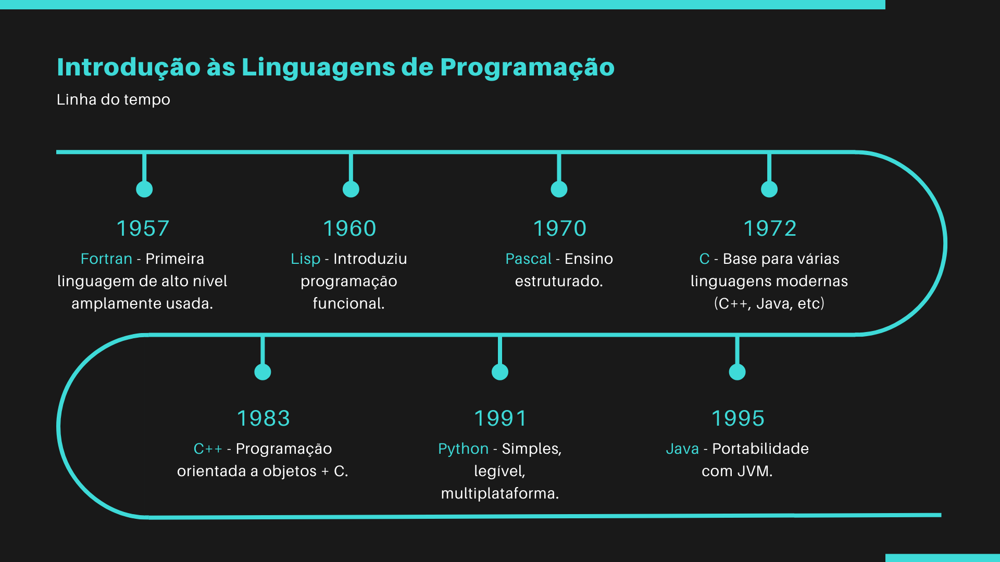
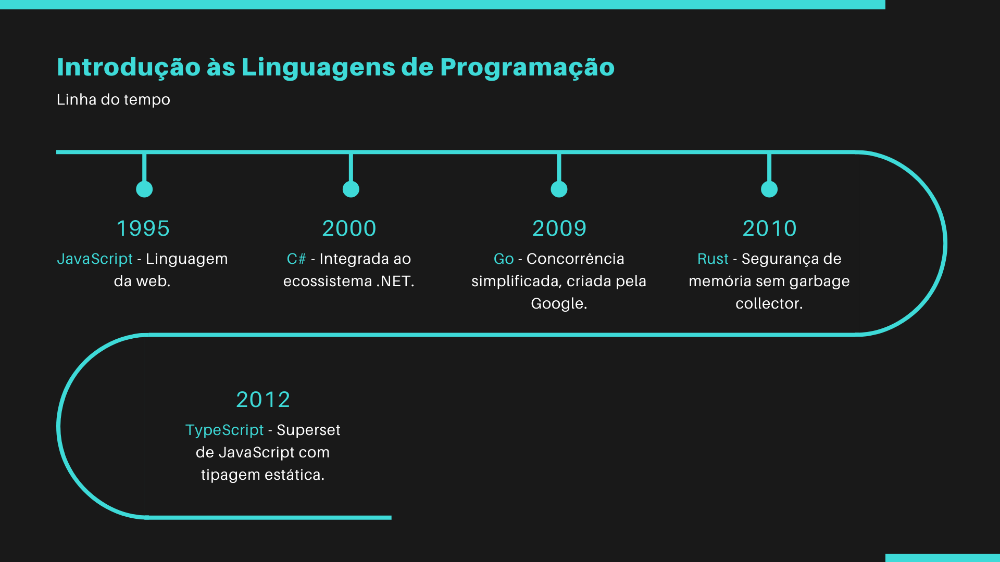

# Desafio 01 – Introdução às Linguagens de Programação

## Objetivo

Este desafio tem como propósito apresentar uma linha do tempo da evolução das linguagens de programação, destacando os principais marcos históricos e suas contribuições para a área da computação.

---

## Linha do Tempo

Abaixo está a linha do tempo criada com base em pesquisa sobre as linguagens de programação mais relevantes de diferentes décadas:

### Parte 1

### Parte 2

As imagens mostram desde linguagens clássicas como Fortran, Lisp e C, até linguagens modernas como Rust, Go e TypeScript.

---

## Ferramenta Utilizada

A linha do tempo foi criada com um modelo visual no Canva, convertida em imagens estáticas para inclusão neste repositório.

---

## Referências

- Sebesta, Robert W. *Conceitos de Linguagens de Programação*. 11ª ed. Pearson, 2018.
- Documentações oficiais das linguagens: Java, Python, C, JavaScript, etc.
- Notas de aula da disciplina *Linguagens de Programação* – Prof. Bruno de Castro.

## Autoria

Aluna: Antonia Fabiana Rodrigues Oliveira
Disciplina: Linguagens de Programação.
Professor: Bruno Honorato – Universidade Federal do Ceará (UFC).

---