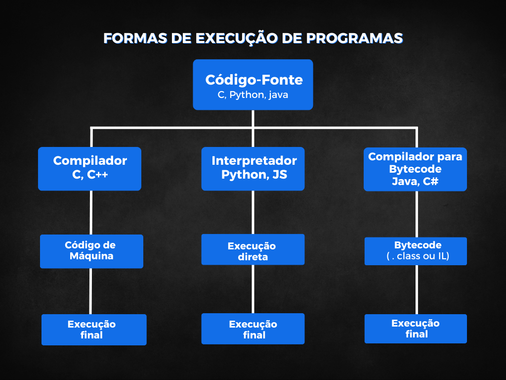

# Desafio 02 – Formas de Execução de Programas

Este desafio tem como objetivo explicar os diferentes ambientes de execução de programas, ou seja, as formas como o código-fonte pode ser processado e executado, dependendo da linguagem e do ambiente utilizado.

## 🎯 Conceitos Apresentados

A execução de um programa pode ocorrer por três caminhos principais:

### 🛠️ 1. Compilador
O compilador traduz todo o código-fonte para **código de máquina** (binário) de uma só vez, gerando um arquivo executável.

- **Linguagens típicas:** C, C++
- **Resultado:** Executável que roda diretamente no sistema operacional

### 🔍 2. Interpretador
O interpretador executa **o código-fonte linha por linha**, em tempo real, sem gerar um executável. Essa abordagem é mais flexível e dinâmica, mas tende a ser menos eficiente em termos de desempenho.

- **Linguagens típicas:** Python, JavaScript
- **Resultado:** Código interpretado em tempo de execução

### 🧱 3. Compilador para Bytecode
Algumas linguagens (como Java e C#) utilizam um modelo híbrido:
1. O código é **compilado para um formato intermediário** chamado bytecode.
2. O bytecode é então executado por uma **máquina virtual** (JVM no caso do Java, CLR no caso do C#), que interpreta e otimiza o código conforme necessário.

- **Linguagens típicas:** Java (.class), C# (IL - Intermediate Language)
- **Resultado:** Bytecode executado em ambiente controlado, com portabilidade entre sistemas

---

## 📊 Diagrama Ilustrativo

Abaixo está o diagrama que resume esses três caminhos de execução:

## 📌 Conclusão

Entender as diferentes formas de execução é essencial para escolher a linguagem e o ambiente mais adequados para um projeto. Cada abordagem tem vantagens e desvantagens em termos de performance, portabilidade e complexidade.

---

### Autora

> Antonia Fabiana Rodrigues Oliveira - disciplina Linguagens de Programação - UFC.