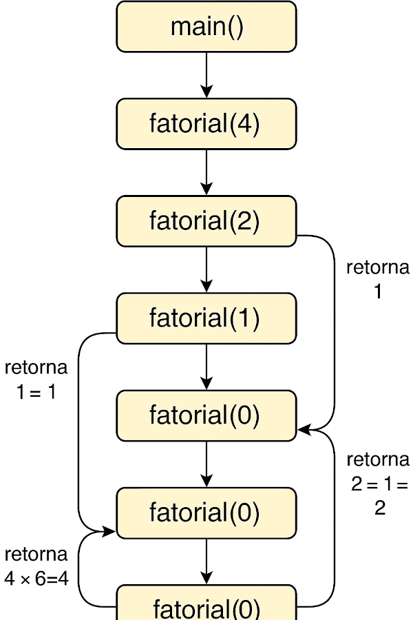

# Desafio 07 – Implementação de Subprogramas

## Objetivo

Demonstrar, de forma prática e visual, como funciona a **pilha de chamadas** (call stack) durante a execução de um subprograma recursivo. O exemplo escolhido é o cálculo do fatorial de um número utilizando a linguagem C.

---

## Linguagem utilizada

- Linguagem C

---

## Funcionalidades do código

O programa desenvolvido possui as seguintes funcionalidades:

- Calcula o fatorial de um número inteiro utilizando recursão;
- Demonstra o uso da **pilha de chamadas**;
- Apresenta a estrutura de empilhamento e desempilhamento de chamadas de função;
- Exibe o resultado no terminal com `printf`.

---

## Código-fonte utilizado

```c
#include <stdio.h>

int fatorial(int n) {
    if (n == 0 || n == 1)
        return 1;
    else
        return n * fatorial(n - 1);
}

int main() {
    int numero = 4;
    printf("Fatorial de %d = %d\n", numero, fatorial(numero));
    return 0;
}

``` 

## Funcionamento da Pilha de Chamadas

Durante a execução, cada chamada da função fatorial é empilhada até atingir o caso base (n == 0 ou n == 1). Depois disso, as funções vão retornando seus valores, desempilhando a pilha até chegar à chamada inicial.

---

## Chamadas realizadas (empilhamento):

1. fatorial(4)

2. fatorial(3)

3. fatorial(2)

4. fatorial(1)

5. fatorial(0)

## Retornos (desempilhamento):

1. fatorial(0) retorna 1

2. fatorial(1) retorna 1 × 1 = 1

3. fatorial(2) retorna 2 × 1 = 2

4. fatorial(3) retorna 3 × 2 = 6

5. fatorial(4) retorna 4 × 6 = 24

---

## Diagrama da Pilha de Chamadas

A imagem a seguir representa visualmente o empilhamento e desempilhamento das chamadas recursivas da função fatorial:



---

## Referências

SEBESTA, Robert W. Conceitos de Linguagens de Programação. 10ª ed. Pearson, 2018.
Diagrama criado com canva.
Notas de aula da disciplina de Linguagens de Programação – UFC

---

## Autoria 

Aluna: Antonia Fabiana Rodrigues Oliveira
Disciplina: Linguagens de Programação.
Professor: Bruno Honorato – Universidade Federal do Ceará (UFC).